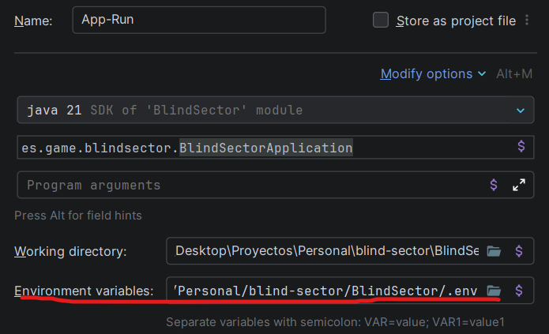

# BlindSector

> Juego táctico por turnos 1v1 con resolución simultánea e información parcial. Proyecto de aprendizaje para validar
> sistemas de concurrencia, snapshots de estado y mecánicas de incertidumbre espacial.

---

## Descripción

**BlindSector** es un juego multijugador en el que dos jugadores se posicionan y bombardean mutuamente sobre un tablero
de **15×15 celdas**, sin conocer la posición exacta del rival. Al finalizar cada turno, el servidor revela únicamente la
*región general* donde se encuentra el oponente, manteniendo la incertidumbre como eje táctico central.

La mecánica de resolución simultánea obliga a ambos jugadores a actuar al mismo tiempo: predecir el movimiento rival,
elegir entre reposicionarse o mantenerse quieto (bono Sniper), y decidir dónde bombardear con información incompleta.

---

## Resumen Técnico

| Elemento              | Detalle                                |
|-----------------------|----------------------------------------|
| **Lenguaje**          | Java 21                                |
| **Framework**         | Spring Boot 4.0.6                      |
| **Base de datos**     | MySQL (metadata no operativa)          |
| **Estado en memoria** | `ConcurrentHashMap<String, GameState>` |
| **Concurrencia**      | `ReentrantLock` por partida            |
| **Build**             | Maven (Maven Wrapper incluido)         |

### Arquitectura

Monolito modular organizado por dominio funcional:

```
src/main/java/es/game/blindsector/
│
├── BlindSectorApplication.java
│
├── shared/          # Enums, excepciones, utils, DTOs compartidos
├── config/          # Beans y configuración técnica de Spring
├── infrastructure/  # Memoria activa, locking por partida, scheduler de timeouts
├── contracts/       # Puertos e interfaces entre módulos
│
├── game/            # Dominio principal: engine, validaciones, resolución de turno
├── player/          # Estado de jugador y sesión
├── lobby/           # Crear sala, unirse, iniciar partida
├── turn/            # Acciones de turno, coordinación y timeouts
├── snapshot/        # Generación de respuesta para el cliente
└── persistence/     # Entidad JPA + repositorio MySQL (solo al crear y terminar)
```

### Principios de diseño

- **Información parcial:** nunca se expone la posición exacta del rival, solo su región (cuadrícula 3×3 de regiones de
  5×5).
- **Resolución simultánea determinista:** ambos jugadores actúan a la vez; el mismo estado de entrada siempre produce el
  mismo resultado.
- **Separación memoria / persistencia:** MySQL recibe exactamente 2 operaciones por partida (INSERT al crear, UPDATE al
  terminar). El estado operativo vive exclusivamente en memoria.
- **Concurrencia segura:** `ReentrantLock` por partida previene doble resolución bajo carga concurrente.
- **Idempotencia HTTP:** acciones versionadas por número de turno + deduplicación por `containsKey`.

---

## Clonar y configurar el entorno

### Requisitos previos

- Java 21+
- Maven 3.9+ (o usar el wrapper incluido `./mvnw`)
- MySQL

### 1. Clonar el repositorio

```bash
git clone https://github.com/<tu-usuario>/BlindSector.git
cd BlindSector
```

### 2. Crear la base de datos

```sql
CREATE
DATABASE blind_sector;
```

### 3. Configurar variables de entorno

Copiar el archivo de ejemplo y rellenar los valores:

```bash
cp .env.example .env
```

Editar `.env`:

```env
DB_URL=jdbc:mysql://localhost:3306/blind_sector
DB_USER=tu_usuario
DB_PASS=tu_contraseña
```

> Las variables son leídas por `application.yaml` en tiempo de ejecución. El archivo `.env` no debe subirse al
> repositorio (ya está en `.gitignore`).

### 4. IDE recomendado — IntelliJ IDEA

Se recomienda usar **IntelliJ IDEA**. Para que el IDE cargue automáticamente las variables de
entorno del archivo `.env`, configura la Run Configuration de la siguiente forma:

1. Ve a **Run > Edit Configurations**.
2. Selecciona o crea una configuración de tipo **Application** apuntando a `es.game.blindsector.BlindSectorApplication`.
3. En el campo **Environment variables**, indica la ruta al archivo `.env` del proyecto.



> Sin este paso, Spring Boot no encontrará `DB_URL`, `DB_USER` ni `DB_PASS` al arrancar desde el IDE.

### 5. Compilar y ejecutar

#### Opcion 1:

  ```bash
  ./mvnw spring-boot:run
  ```

O con Maven instalado globalmente:

  ```bash
  mvn spring-boot:run
  ```

#### Opcion 2:

- Click en el boton Run del IDE

La aplicación arranca en `http://localhost:8081`.

---

## Cómo contribuir

Las contribuciones se gestionan mediante **Pull Requests** desde ramas propias contra `main`.

### 1. Crea una rama desde `main`

```bash
git checkout main
git pull
git checkout -b <prefijo>/<descripcion-corta>
```

Convenciones de nombre de rama:

| Tipo                | Prefijo              | Ejemplo                     |
|---------------------|----------------------|-----------------------------|
| Nueva funcionalidad | `feature/` o `feat/` | `feature/turn-timeout`      |
| Corrección de bug   | `fix/`               | `fix/lock-race-condition`   |
| Refactor            | `refactor/`          | `refactor/snapshot-factory` |
| Documentación       | `docs/`              | `docs/update-readme`        |

### 2. Realiza tus cambios y súbelos

```bash
git push origin <prefijo>/<descripcion-corta>
```

### 3. Abre el Pull Request

En GitHub, abre el PR contra `main` con un título descriptivo y una breve explicación de qué implementa o corrige.

---

> Para dudas sobre arquitectura o decisiones de diseño, consulta [`blind_sector_design.md`](./blind_sector_design.md)
> y [`blind_sector_structure.md`](./blind_sector_structure.md).
